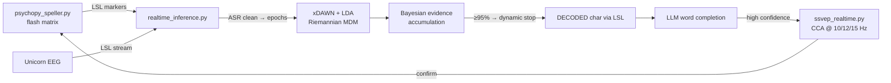
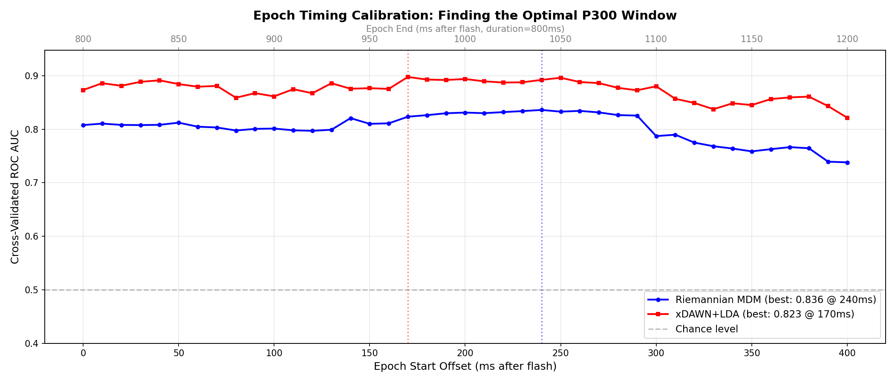
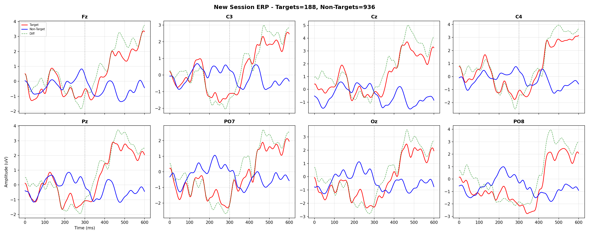

# Real-Time P300 BCI Speller with LLM Word Completion

Type with your brain. A PsychoPy character matrix flashes rows and columns while an 8-channel **g.tec Unicorn** records EEG. A real-time decoder then picks the character you're attending to from the **P300** response it evokes. An LLM suggests word completions, and the user confirms them hands-free through an **SSVEP** (steady-state visual evoked potential) selector.

## Architecture


- **Streaming:** EEG and stimulus markers both arrive over **Lab Streaming Layer** with dejittered, thread-safe inlets. The decoder publishes results as an LSL marker stream the UI listens to. Blocking resolves run in an `asyncio` executor.
- **Cleaning:** a pre-fitted **Artifact Subspace Reconstruction** state (`asrpy`) is applied in transform-only mode, keeping real-time latency low.
- **Classification:** an **xDAWN spatial filter + LDA** pipeline, with a Riemannian **MDM** classifier on xDAWN covariances as the second model.
- **Dynamic stopping:** instead of a fixed number of flash repetitions, per-flash target probabilities are accumulated in a Bayesian update. A character is emitted once one letter passes 95% confidence (or the top-1/top-2 ratio test passes), with a fallback after the maximum number of repetitions. Easy letters come out faster.
- **LLM assist:** decoded characters build a word and sentence buffer that is sent to an OpenAI-compatible API for completions. When the model's confidence passes a tunable threshold, the SSVEP selector opens, and **CCA** over 3 target frequencies with harmonics lets the user accept the suggestion by looking at it.

## Synthetic sample clock: jitter-free alignment with zero added latency
The hardest bug in real-time P300 decoding was timing. Unicorn Recorder stamps samples with their LSL **delivery** time, and they arrive in bursts. So an 800 ms (200-sample) epoch could span anywhere from 0.5 to 1.1 s of "time", and the P300 got smeared or cut off.

The decoder therefore throws away the per-sample delivery stamps and rebuilds a clock from the hardware's fixed 250 Hz rate:

```
ideal_offset[n] = n / fs                            # sample n since session start
anchor          = min over all chunks of (lsl_timestamp - ideal_offset)   # lower envelope = true transport delay
t[n]            = anchor + ideal_offset[n]          # perfectly uniform, on the same LSL clock as the flash markers
```

Taking the running **minimum** makes the anchor converge to the fastest observed delivery, which strips out burst jitter. Each chunk's timestamps are computed the moment it arrives, so there's **no smoothing buffer and no added latency**. Every flash marker now lands on the right sample, within one sample period (4 ms).

## Tuning the epoch window
With timing fixed, the post-flash window itself was calibrated by sweeping the epoch start from 0 to 400 ms and measuring cross-validated single-flash ROC-AUC for both decoders:



Grand-average target vs. non-target responses on the 8 Unicorn channels (188 targets / 936 non-targets):



## Run
Python ≥ 3.11 with [uv](https://docs.astral.sh/uv/):
```bash
uv sync
# 1) start Unicorn Recorder with LSL output ("UnicornRecorderLSLStream")
# 2) calibrate: record labelled flashes with the speller UI
uv run python psychopy_speller.py
# 3) run the decoder (loads the trained models and the ASR state)
uv run python realtime_inference.py
```
LLM completion needs an `OPENAI_API_KEY` (or a compatible endpoint) in `.env`.

## Context
Built for **NeuroTech ASU**, the NeuroTechX chapter I founded.

## Tech
`Python` · `PsychoPy` · `pylsl` · `pyRiemann` (xDAWN, MDM) · `scikit-learn` · `asrpy` · `MNE` · `SciPy` · `asyncio` · OpenAI-compatible API
