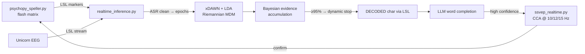

# Real-Time P300 BCI Speller with LLM Word Completion

Type with your brain. A PsychoPy character matrix flashes rows and columns while an 8-channel **g.tec Unicorn** records EEG. A real-time decoder then picks the character you're attending to from the **P300** response it evokes. An LLM suggests word completions, and the user confirms them hands-free through an **SSVEP** (steady-state visual evoked potential) selector.

## Architecture


- **Streaming:** EEG and stimulus markers both arrive over **Lab Streaming Layer** with dejittered, thread-safe inlets. The decoder publishes results as an LSL marker stream the UI listens to. Blocking resolves run in an `asyncio` executor.
- **Cleaning:** a pre-fitted **Artifact Subspace Reconstruction** state (`asrpy`) is applied in transform-only mode, keeping real-time latency low.
- **Classification:** an **xDAWN spatial filter + LDA** pipeline, with a Riemannian **MDM** classifier on xDAWN covariances as the second model.
- **Dynamic stopping:** instead of a fixed number of flash repetitions, per-flash target probabilities are accumulated in a Bayesian update. A character is emitted once one letter passes 95% confidence (or the top-1/top-2 ratio test passes), with a fallback after the maximum number of repetitions. Easy letters come out faster.
- **LLM assist:** decoded characters build a word and sentence buffer that is sent to an OpenAI-compatible API for completions. When the model's confidence passes a tunable threshold, the SSVEP selector opens, and **CCA** over 3 target frequencies with harmonics lets the user accept the suggestion by looking at it.

## Run
Python ≥ 3.11 with [uv](https://docs.astral.sh/uv/):
```bash
uv sync
# 1) start Unicorn Recorder with LSL output ("UnicornRecorderLSLStream")
# 2) calibrate: record labelled flashes with the speller UI
uv run python psychopy_speller.py
# 3) run the decoder (loads the trained models and the ASR state)
uv run python realtime_inference.py
```
LLM completion needs an `OPENAI_API_KEY` (or a compatible endpoint) in `.env`.

## Context
Built for **NeuroTech ASU**, the NeuroTechX chapter I founded.

## Tech
`Python` · `PsychoPy` · `pylsl` · `pyRiemann` (xDAWN, MDM) · `scikit-learn` · `asrpy` · `MNE` · `SciPy` · `asyncio` · OpenAI-compatible API
